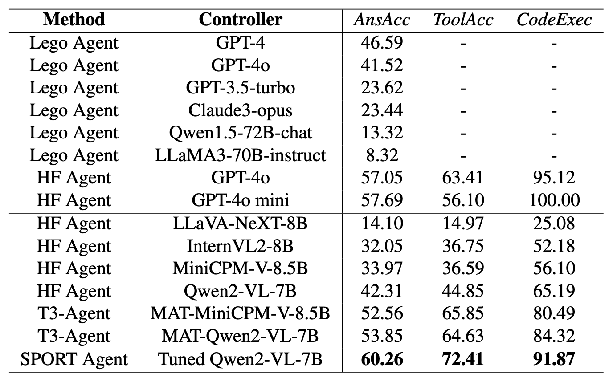

# 🎯 SPORT: Iterative Trajectory Exploration for Multimodal Agents

<div align="center">

[](https://arxiv.org/abs/2504.21561)
[](https://sport-agents.github.io)
[](https://arxiv.org/pdf/2504.21561)

</div>

SPORT introduces an online self-exploration loop that enables multimodal agents to self-improve via AI-generated tasks and LLM-verified preference tuning without human annotations.

## 📋 Key Features

- **Task Synthesis**: Automatically generates multimodal tasks using language models
- **Step Sampling**: Proposes and executes multiple candidate actions at each decision point
- **Step Verification**: Uses LLM as a critic to compare and rank action outcomes
- **Preference Tuning**: Updates agent policy through preference-based optimization

## 🎯 Results

### GTA Benchmark Performance

Our SPORT Agent demonstrates significant improvements over baseline models:

- **+7%** in Answer Accuracy (AnsAcc)
- **+8%** in Tool Accuracy (ToolAcc)
- **+7%** in Code Execution Success (CodeExec)



## 📋 Project Structure

The project consists of several main components:
- 📊 `data_generation/`: Contains the data generation pipeline
- ✅ `closed_loop_verifier/`: Verification and validation tools
- 🤖 `tongagent/`: Core agent implementation
- 🔧 `script/`: Utility scripts

## 🚀 Quick Start

### Installation
```bash
pip install -r requirements.txt
```

### Environment Setup
The project uses environment variables for configuration. Make sure to set up your `.env` file and `configs/agent_config.yaml` with the necessary credentials and settings.

## 📥 Data Preparation

### Images and Embeddings
The image captions and caption embeddings can be downloaded via the following link:
[📦 Google Drive](https://drive.google.com/drive/folders/1Ek6qfmhcaTd7zTEQcBvELh6i7unVhTrk?usp=sharing)

Please download the images and embeddings and put them in 'data_generation/sharegpt4v'.

## 📝 Citation

If you find this work useful, please cite our paper:
```bibtex
@inproceedings{li2025iterative,
  title={Iterative Trajectory Exploration for Multimodal Agents}, 
  author={Li, Pengxiang and Gao, Zhi and Zhang, Bofei and Mi, Yapeng and Ma, Xiaojian and Shi, Chenrui and Yuan, Tao and Wu, Yuwei and Jia, Yunde and Zhu, Song-Chun and Li, Qing},
  year={2025},
  eprint={2504.21561},
  archivePrefix={arXiv},
  url={https://arxiv.org/abs/2504.21561}, 
}
```

## 🤝 Contributing

We welcome contributions! Please feel free to submit a Pull Request.

## 📄 License

This project is licensed under the MIT License - see the LICENSE file for details.

---

<div align="center">
  
</div>
